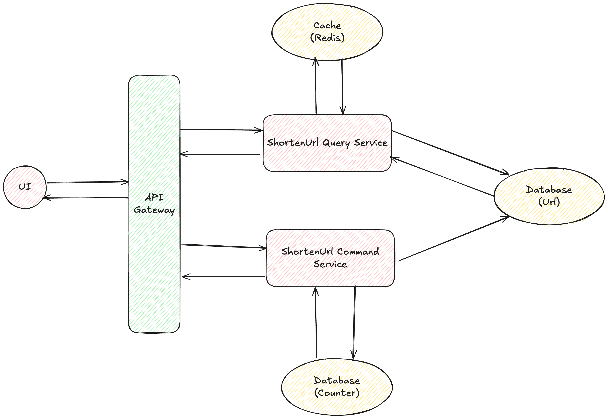

# URL Shortener

## Overview
The URL shortener is a helper for shortening the long URL from the user's input.

## Requirements
### Functional Requirements
* Users are able to submit a long URL and receive a shortened version.
* Users should be able to reversely find the original long URL from the shortened URL.

### Non-Functional Requirements
* The system should ensure uniqueness for the short codes.
* The redirection should occur within minimal delay. (< 100ms)
* The system should be reliable and available at the most of the time. (availability > consistency)
* The system should scale to support 1B shorted URLs and 100M DAU.
* Data need to be removed after 3 months for preventing storage issue.

## UML
### Component Diagram

